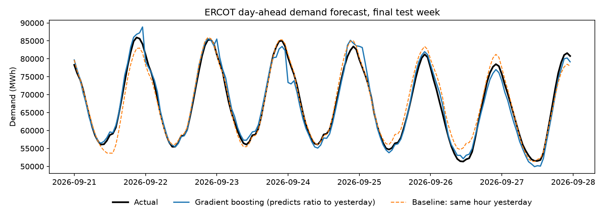

# GridSense: Day-Ahead ERCOT Demand Forecasting

Forecasts tomorrow's hourly electricity demand on the Texas grid (ERCOT) from public data. Batteries earn money by charging when demand and prices are low and discharging at peaks, so knowing tomorrow's demand curve is the first input to a battery dispatch plan.

**Pipeline:** EIA API + Open-Meteo → pandas cleaning → SQLite → SQL feature query → NumPy features → scikit-learn models → evaluation against baselines.

| Folder | What's in it |
| --- | --- |
| `src/fetch_data.py` | Downloads hourly ERCOT demand (EIA API, paginated) and Texas temperatures (Open-Meteo) |
| `src/cleaning.py` | pandas/NumPy cleaning and feature functions: gap filling, outlier removal, cyclical and degree-day features |
| `src/load_db.py` | Loads the cleaned data into SQLite and writes a data-quality report |
| `sql/features.sql` | Builds the feature table with a JOIN and window functions (`LAG`, rolling `AVG`) |
| `sql/features_databricks.sql` | The same query for Databricks SQL (optional) |
| `src/train.py` | Trains Ridge regression and gradient boosting two ways (raw demand vs. ratio to yesterday), compares them to baselines, saves metrics and a plot |
| `tests/` | pytest unit tests for the cleaning and feature logic |

## Setup (about 15 minutes)

1. Get a free EIA API key at <https://www.eia.gov/opendata/> (click "Register"; the key is emailed to you).
2. Set up Python 3.10+:

```bash
cd gridsense
python -m venv .venv
source .venv/bin/activate        # Windows: .venv\Scripts\activate
pip install -r requirements.txt
export EIA_API_KEY=your_key_here # Windows PowerShell: $env:EIA_API_KEY="your_key_here"
```

## Run it

```bash
python -m pytest                                           # 1. unit tests should all pass
python -m src.fetch_data --start 2023-01-01 --end 2026-09-27  # 2. download (~7 EIA pages, a few minutes)
python -m src.load_db                                      # 3. clean and load into SQLite
python -m src.train --test-days 90                         # 4. train and evaluate
```

Use an `--end` date at least a week in the past; the weather archive lags a few days behind.

Outputs land in `results/`: `data_quality.json`, `metrics.csv`, and `forecast_week.png`.

## Results

The best model, gradient boosting predicting the ratio to yesterday, averages **1.63% error** on a 90-day summer holdout (June 30 to Sept. 27, 2026). That is 30% more accurate than repeating yesterday's demand.

| Model | MAE (MWh) | MAPE | vs. best baseline |
| --- | --- | --- | --- |
| Gradient boosting (predicts ratio to yesterday) | 1,154 | 1.63% | 30% better |
| Ridge (predicts ratio to yesterday) | 1,296 | 1.83% | 21% better |
| Ridge (predicts demand level) | 2,125 | 2.97% | 29% worse |
| Gradient boosting (predicts demand level) | 4,450 | 6.20% | 170% worse |
| Baseline: same hour yesterday | 1,650 | 2.37% | — |
| Baseline: same hour last week | 2,710 | 3.83% | — |

MAE = mean absolute error. MAPE = mean absolute percentage error.



### What went wrong first, and the fix

My first models predicted demand in megawatt-hours directly, and both lost to the simplest baseline (repeat yesterday's value). Gradient boosting's error was 2.7x the baseline's.

The cause was load growth. Average ERCOT demand rose from 51.0 GW in 2023 to 55.7 GW in 2025, and summer 2026 set a new peak of 91,075 MWh, well above the 85,544 MWh training maximum. Tree-based models can't predict values outside the range they were trained on, so they systematically under-forecast record days.

The fix was to reframe the target: predict tomorrow's demand as a **ratio to the same hour today**, using scale-free features (temperature change since yesterday, weekend and holiday transitions, recent demand ratios). A 3% bump on a hotter day looks the same at 50 GW or 90 GW, so the model no longer needs to extrapolate. This cut gradient boosting's error by 74% (4,450 to 1,154 MWh) and moved it from well behind the baseline to 30% ahead. The original models stay in the table above so the improvement is visible.

## Design decisions

- **No data leakage.** Every demand feature looks back at least 24 hours, so the model only uses what is known the day before. Train/test splits are by time (train on the past, test on the most recent 90 days), never shuffled.
- **Honest gap filling.** Gaps of 3 hours or less are interpolated. Longer gaps are left missing rather than partly filled, because pandas' default `interpolate(limit=n)` would invent the first few hours of a long outage.
- **Outlier detection that respects daily cycles.** Each hour is compared to the same hour on the three days before and after. A plain rolling median flags normal afternoon peaks as outliers.
- **Time zones.** Rows are ordered by UTC so daylight-saving changes don't break the lags; calendar features use Central time because demand follows people's routines.
- **Baselines first.** A model is only useful if it beats "same hour yesterday" and "same hour last week." Comparing against them is how this project caught the load-growth problem.
- **Scale-free target.** The best models predict the ratio to yesterday rather than raw demand, so they keep working as the grid grows.
- **Known limitation.** The model uses observed temperature for the forecast day. In production you'd use a weather *forecast*, so these results are an upper bound. A good next step is training with forecast temperatures.

## Optional: Databricks

1. Create a free account at Databricks Free Edition.
2. Export the two tables: `sqlite3 -header -csv data/gridsense.db "select * from demand" > demand.csv` (same for `weather`).
3. Upload both CSVs as tables (**Catalog → Add data → Create table**). They are stored as Delta tables.
4. Open the SQL editor and run `sql/features_databricks.sql` to create `gridsense_features`.

Only list Databricks on your resume after you've done this.
